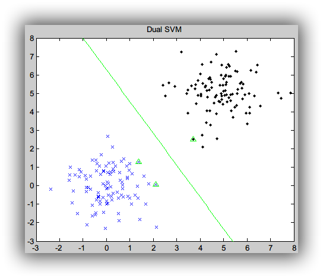
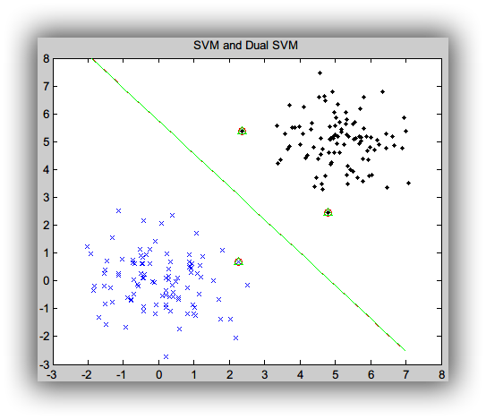
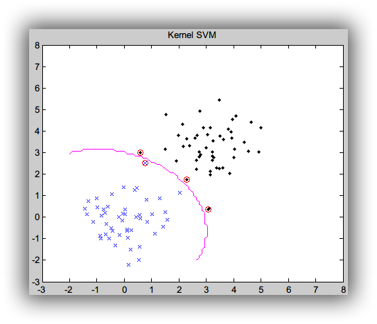
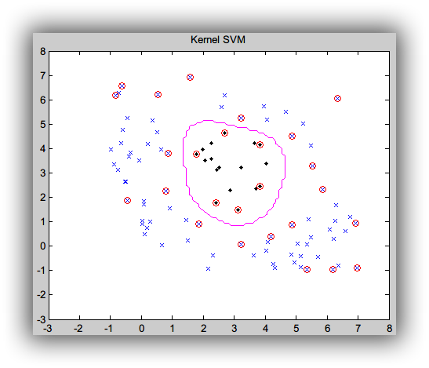

## SVM (支持向量机)

### 1. 说明

[SVM 支持向量机](http://blog.csdn.net/endlch/article/details/46843903)

[Dual SVM 对偶支持向量机](http://blog.csdn.net/endlch/article/details/46851361)

[Kernel SVM](http://blog.csdn.net/endlch/article/details/46865753)

### 2. 结果

